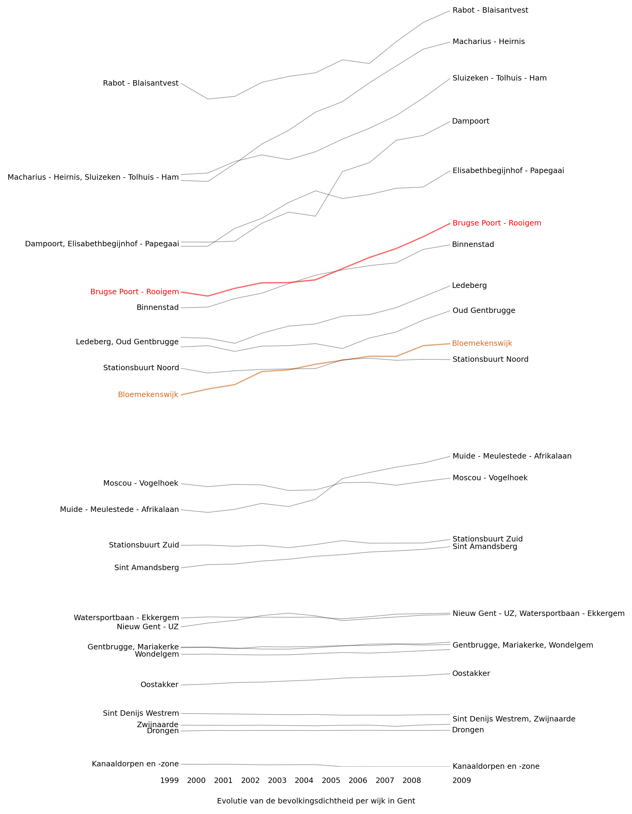

# open_data_showcases
Repo with some draft checks of open data sets, as showcase of just out of interest...

To watch the notebooks without python, you can use the online nbviewer: http://nbviewer.ipython.org/
Jut copy-paste the URL of the ipython notebook (.ipynb extension) in the fill-in field to see the outcome.

## Vehicle registration in Belgium

Dataset of registration of vehicles in Belgium, downloaded from
http://mobilit.belgium.be/nl/publicaties/open_data/.
(Mainly Python Pandas and seaborn usage)

## openweathermap

API test of the openweathermap.org data API with a quick visualisation of the output, using pure Python.

## Gent cijfers
Visualisations of open data of the City of Ghent.

Migration of people in the different parts of Ghent in time:

Evolution of the density of the different parts of Ghent in time:

Interesting observation is that already dense regions are only getting more dense...
